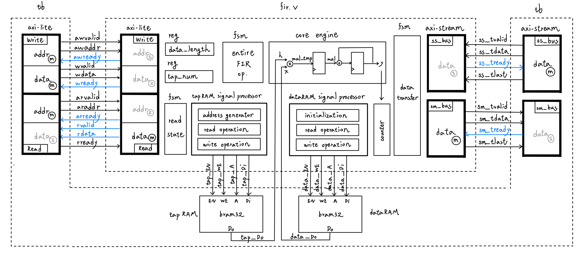

## Lab3 FIR
### Overview
This `FIR` module is implemented with an `AXI4-Lite` interface for configuration and `AXI4-Stream` interfaces for input and output data transfer. The design includes a main `FSM` for overall FIR operation control, a `core engine` for computation, and a `BRAM signal processor` for managing coefficient addressing and data storage.

### Hackmd report
For more details, refer to :
https://hackmd.io/9N8llY-tTKGlezyOHlR_Jg